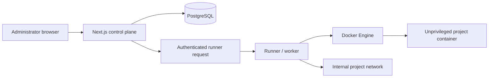

<p align="center">
  
</p>

# SULAYER CLOUD PANEL

> A cyberpunk, open-source control panel for deploying and managing authorized bots, workers, APIs, websites, and automation services.

[](LICENSE)
[](docker-compose.yml)
[](apps)
[](CONTRIBUTING.md)

SULAYER is a control plane—not an unbounded execution service. It is designed only for applications and infrastructure you own or are authorized to administer. The Next.js web service manages identity, configuration, audit records, and encrypted variables. A distinct worker owns Docker builds and project containers.

## Highlights

- Glassmorphism, cyberpunk-responsive control center with supplied-brand URL overrides and local visual fallbacks.
- Initial owner bootstrap from environment variables, Argon2id password hashing, signed HTTP-only sessions, basic login throttling, role checks, and audit events.
- Project creation workflow for Git, GitHub URL, ZIP/import, empty, and template sources; runtime command presets for Node, Python, Java, Go, Rust, PHP, Docker, and static sites.
- AES-256-GCM environment variable encryption. The control-plane list API intentionally never returns raw values.
- Separate Docker runner with non-root project containers, dropped capabilities, `no-new-privileges`, read-only root filesystem, internal networking, PID limit, CPU/RAM limits, and no Docker socket in workloads.
- Docker Compose, Railway descriptor, Render blueprint, PostgreSQL schema, and health endpoint.

## Architecture



The web service does not start user programs. Only the worker is allowed Docker Engine access. The worker emits no environment-variable values into its deployment logs.

## Supported runtime presets

| Runtime | Default start strategy |
| --- | --- |
| Node.js | `npm start` |
| Python | `python main.py` |
| Java | `java -jar target/*.jar` |
| Go | `./app` |
| Rust | `./target/release/app` |
| PHP | `php -S 0.0.0.0:8080 -t public` |
| Docker | Existing `Dockerfile` CMD |
| Static | `npx serve -s dist -l 3000` |

Review generated commands before deploying. An existing repository `Dockerfile` is used as the build contract.

## Quick start

Requirements: Docker Engine/Compose, a host where you are authorized to run containers, and at least 2 GB RAM for the panel services (plus capacity for project workloads).

```bash
[git clone https://github.com/USERNAME/sulayer-cloud-panel.git](https://github.com/SLAYER902/SUSTING-TOOL-Open-Source-Bot-Application-Hosting-Control-Center.git)
cd sulayer-cloud-panel
cp .env.example .env
```

Set a unique `POSTGRES_PASSWORD`, `ADMIN_PASSWORD`, `SESSION_SECRET`, `ENCRYPTION_KEY`, and `RUNNER_SHARED_SECRET` in `.env`. Generate random values with:

```bash
openssl rand -base64 32
```

`ADMIN_PASSWORD` must be at least 14 characters and include upper-case, lower-case, and numeric characters. It is never printed by the application.

```bash
docker compose up -d --build
```

Open `http://localhost:80`, then sign in with `ADMIN_USERNAME`. The web health check is available at `GET /api/health`.

## Docker deployment

`docker-compose.yml` starts `web`, `worker`, PostgreSQL, Redis, and Caddy. Persistent data uses named volumes for PostgreSQL, Redis, project workspaces, build cache, and proxy state.

The example Caddy configuration is intentionally local-only. For VPS HTTPS, configure a domain-aware Caddyfile (or Traefik/Nginx) and route only approved HTTP services. Do not expose arbitrary container ports.

The runner needs Docker socket access to create isolated containers. Treat it as a privileged infrastructure component: run it on a trusted host and do not copy that mount into a project service.

## Railway and Render

`railway.json` deploys the control-plane image and checks `/api/health`. Railway’s managed environment generally cannot host arbitrary sibling Docker workloads; use its provider API adapter once configured, or point the panel at a separately authorized runner.

`render.yaml` declares a control-plane service, runner service, and Postgres. Render configuration still requires you to set the secret values in its dashboard. Whether a provider supports arbitrary workload containers depends on that provider’s product and permissions; the UI should not be interpreted as bypassing those limits.

## Environment variables

| Variable | Required | Purpose |
| --- | --- | --- |
| `DATABASE_URL` | Yes | PostgreSQL connection string |
| `POSTGRES_PASSWORD` | Compose | Database superuser password |
| `ADMIN_USERNAME`, `ADMIN_PASSWORD` | First boot | Initial owner account |
| `SESSION_SECRET` | Yes | At least 32 characters; signs browser sessions |
| `ENCRYPTION_KEY` | Yes | Base64/hex 32-byte AES-GCM key |
| `RUNNER_SHARED_SECRET` | Yes | Authenticates control-plane requests to the runner |
| `RUNNER_URL` | Yes | Runner’s private URL |
| `GITHUB_*`, `RAILWAY_API_TOKEN`, `RENDER_API_KEY` | Optional | Future/provider integration credentials |

Public brand URLs can be overridden with `NEXT_PUBLIC_APP_NAME`, `NEXT_PUBLIC_LOGO_URL`, `NEXT_PUBLIC_LOGIN_BACKGROUND_URL`, and `NEXT_PUBLIC_DASHBOARD_BACKGROUND_URL`. Local SVG fallbacks keep the UI legible when remote images fail.

## GitHub integration

Git source URLs are available today. GitHub OAuth/repository-picker and signed webhook handling require application credentials and are intentionally reserved for the provider integration layer; never accept unsigned webhooks or store Git tokens in frontend code.

## Security model

Read [SECURITY.md](SECURITY.md) before deployment. In particular: no public registration is enabled; public SSH is not installed; secrets are encrypted and masked; projects are non-root containers; host networking and privileged mode are not used by default; project containers cannot access the Docker socket.

## Tests

After dependencies are installed, run:

```bash
npm run db:generate
npm test
npm run build
```

The included tests cover encryption integrity, password policy, and runtime detection. Add database-backed API tests with an isolated PostgreSQL instance in CI.

## Troubleshooting

- **“Server authentication has not been configured safely”** — set a strong admin password and a 32+ character session secret.
- **Deployment cannot start** — verify `RUNNER_URL`, matching `RUNNER_SHARED_SECRET`, the worker health endpoint, Docker socket permissions, and source availability.
- **Build fails** — open the deployment log record, correct the project source/command, then rebuild. Secret values are deliberately omitted from logs.
- **Container cannot access the internet** — the default project network is internal. Add an explicit egress/network policy only after reviewing the workload’s needs.

## Roadmap

- [x] Control-plane authentication, projects, encrypted configuration, and local Docker runner boundary
- [x] Responsive branded operations UI and Docker deployment descriptors
- [ ] Validated ZIP upload with streamed progress and path-traversal tests
- [ ] SSE/xterm log tailing, metrics persistence, and rollback interface
- [ ] GitHub App/OAuth, signed push webhooks, Railway, and Render adapters
- [ ] Optional TOTP and reusable project templates

## Contributing

See [CONTRIBUTING.md](CONTRIBUTING.md). Please keep provider logic behind adapters, avoid changing security defaults casually, and add tests for every access-control or secret-handling change.

## License

MIT. See [LICENSE](LICENSE).

## Responsible use

Deploy only workloads you own or are authorized to operate. Do not use this project for credential theft, unsolicited messaging, spam, platform abuse, malware, cryptomining, unauthorized access, or attempts to evade hosting-provider limits.
